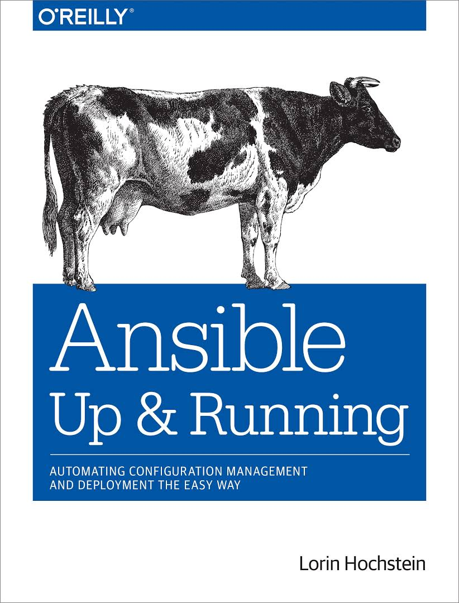

 Being part of Oreilly's **Up & Running** series, this book is a good place to start if you want to learn Ansible, it does cover the core concepts of Ansible, with many examples, it also introduces some basics about Ansible and its underlying technology like Python, YAML, SSH, Cloud Services, AWS IAM etc.