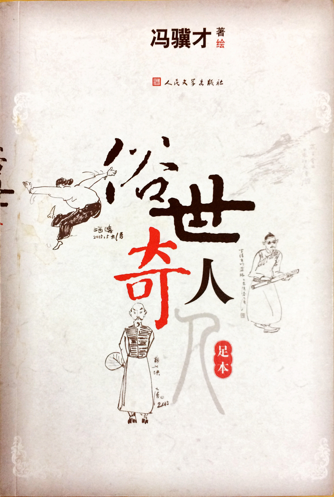

 这是一本闲书，一本薄薄的小册子，但是挺有意思，写的都是小故事，小人物，但个个与众不同，形象鲜明，冯骥才先生亲自绘制的插图，简练传神，图文并茂，每个人物都跃然纸上了。这本书中的故事，有几个比较知名的如“泥人张”、“刷子李”曾经入选了语文课本（我当时用的课本，现在不知道还在不在了）。

# 津门胜地

天津卫，卫是古代屯兵之地的一种称呼，如天津卫、威海卫等，天津是水陆码头，所谓的“九河下梢”，南北运河以及众多支流汇聚海河，由塘沽入渤海。作为中国重要的水陆码头，天津从古至今都是北方重镇，居民五方杂居，货物集散，近代更是经历诸多变故，包括开埠通商以及庚子事变等。码头边的人南来北往，自然少不了能人怪人，码头上讨生活，艰辛不易，所以很多底层的小人物也就有了自己的一手绝活，这本书中很多故事和人物跟码头这个大舞台分不开。书中“泥人张”， “狗不理”， “一阵风”，“龙袍郑” 等都是发生在码头边的故事。

# 多事之秋

奇人异士里面的故事，多数发生在近代，从晚清到民国，这是社会变革最剧烈的一个时期，同时外来的各种思想和事物也进入人们的生活。书中的“洋相”，“背头杨”，“黄莲圣母”等故事都是这个特殊历史时期孕育的，带有鲜明的时代印记。

# 管中窥豹

天津独特人文风情在书中无处不在，吃喝玩乐，天津人的日常生活在冯骥才笔下都显得不同。天津人爱吃，会吃，炸糕、麻花、茶汤、狗不理包子，爱玩，风筝、泥人、杨柳青年画，曲艺相声，爱戏谑，爱起外号，爱八卦。在这三十六个小故事中，天津人的这些特点都有明显的体现，除了书中诸多奇人异士的故事，整本书也是勾勒了天津的市井百态，烟火气息十足。不知今日的天津是否还是这般有意思？

