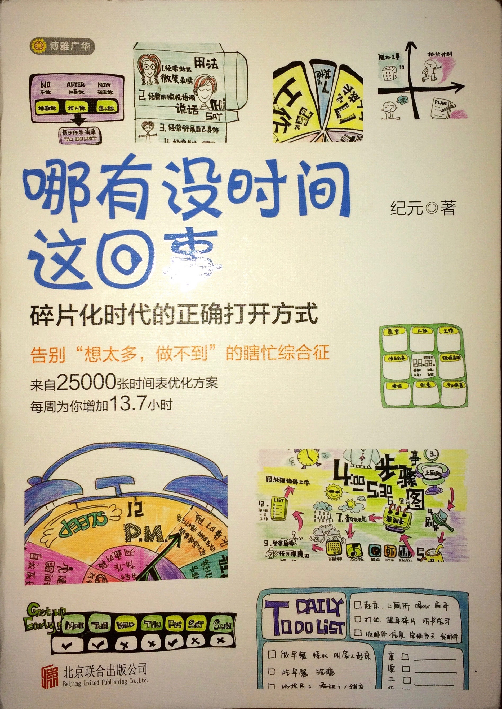

 这是本别人送的书，按照我自己的习惯，我一般是不会买这本书的，也不怎么会看这种书。我总是对这种成功励志之类的书有点反感。但做为一本从实践中总结得来的一本书，其内容还是实用的，对于多数人都有或多或少的参考价值。原书作者的叙述比较长，我这里简单列举重要的几个方面：

## 帕金森定律(Parkinson's Law)

原本的定义是这样的：“work expands so as to fill the time available for its completion”，也就是说如果你给一个工作安排一个小时，那它就会占用一个小时，如果你给它安排10分钟，那它就会占据10分钟。这就提醒我们在安排时间的时候，要结合实际安排合理的实际，如果安排的实际太过充分，则会造成很大的浪费。我们做事情一定要按照实际需要的时间来安排，而不是按照自己所拥有的时间来分配。这是本书中提到的最有价值的一个观点了。

## 时间段 vs 时间表

这是本书中我个人最喜欢的一部分。时间段与时间表的区别就是在于可行性上面，时间表太过死板机械化，导致不能变通，难以执行，最后往往不了了之。时间段则是将一天划分为几个时段，然后结合每个时段安排合适的任务，有序的同时又兼顾灵活，故而又很强的可行性，符合实际情况，更人性化。所以时间表这种只适合机器或者自动化的任务，对于人而言，时间段安排才是比较合理的方法。

## 打卡：简单有效的记录和激励

打卡是非常流行的一个行为了，各种打卡活动和软件也很多，很多商家现在也用打卡这种方式来提高用户活跃度。打卡的优点很多，简而言之，首先是实施简单，往往是点击一下或者用笔打个勾就可以了。打卡的好处也很多，首先它是一种记录方式，虽然包含的信息有限，但是仍然可以提供很多基本的数据，比如什么时候开始做一件事情，坚持做了多久。同时打卡也是一种很强的反馈手段，打卡的记录可以让人很有成就感，如果再配合分享到朋友圈、排行榜等手段，可以进一步强化打卡的作用。

## 仪式感

仪式感(ritual)是现在经常被提起的一个概念了，简而言之，就是把要做的事情固定程序化，并且加上一些额外的属性和含义。与普通的习惯不同的是，由于仪式感的存在，往往更容易被执行，不易被打搅。在现代生活中，比较有仪式性质的时候就是每天早晨和晚上了。睡前和起床后都可以一系列有仪式感的事情，比如总结一天工作、记录一些重要的事情、比如睡前读几页书、比如早起看一会儿新闻等等。

## 工作和生活的界限

要完全区分工作和生活是比较困难的。但是我们应当努力去区分两者的边界，并且尽可能的不要混淆。工作和生活是两中不同目的的活动，不管是工作影响生活还是生活影响工作，都是很不好的。

## 任务清单

任务清单现在已经是比较流行的工具了，很大众化。作者在书中提出了几个概念： 时间段清单，碎片清单，每日清单。除了时间段清单之外，碎片清单和每日清单都是很常见的概念了，像Todoist这样的清单软件，里面就有Inbox清单，用来随时记录琐碎的待办事项，跟作者所提到的碎片清单是一个原理，而Todoist里面的Today清单就是作者所说的每日任务清单了。国外所流行的GTD(Get Task Done)方法也是类似的原理。虽然Todoist等清单软件基本功能都有了，基本可以满足简单的日常使用了。但是我觉得众多清单软件都缺少一个任务依赖管理功能，很多任务之间是有依赖关系的，是一个网状结构，前一个任务未完成的情况下，后续任务是无法开始的，而清单软件里面任务多数都是扁平或者层级结构，并不能准确反映出现实情况。

## 概率与不确定

与时间段任务安排类似，实际中我们总是会遇到各种突发情况或者随机的事情，所以严格按照时间表或者安排计划去执行是不可能的任务，我们也没有必要因此感到沮丧。而是按照概率的思维，在评价一个计划的执行效果时，将时间跨度放大，如果一段时间内多数情况下都能达到目标，那么这就是一个成功的计划。

## 习惯不是简单的重复

习惯不是简单的重复一件事情，而是有意识地去做一件事情。机械重复一件事情是很难的，因为生活充满了变化，很快就会坚持不下去。而习惯则是做一件事情的意识，只要有这个意识，不管环境条件怎么变化，总能找到合适的方式来进行。
