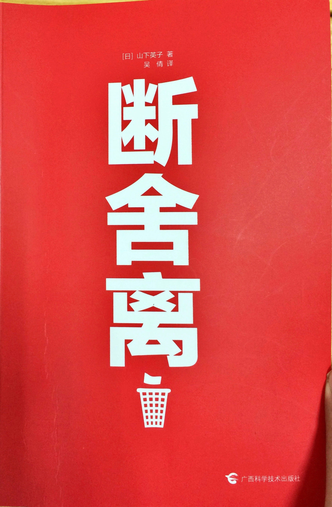

 《断舍离》也算是一本网红书了，或者说，这个概念更准确说这个词一度是网络上非常流行的。如同很多其它的流行词汇一样，虽然很多人跟我一样并没有真正看过这本书，却也不妨碍大家在各种场合使用这个词，也许大家只是单纯的觉得这个词很酷吧。这也让我想起了很多其它的词汇，比如奥卡姆剃刀、黑天鹅、长尾、从0到1、失控，这些词本身都是一本书或者一个理论的名字，很多人都会使用这些词，但是却不一定读过原著，或者认真了解过这些词的起源和原作者本身给这些词赋予的意义。等到真正读到原著时才发现，作者给这个词赋予的含义并不是如同自己想象的那样，并不是这个词字面上理解的那样，有时甚至相差甚远。这也算是一种提醒了，就如同我们看到一个不会读的汉字，不能简单地根据它的部首构成来推测它的读音一样，时常会得到错误的结果。

首先对于这个词，断舍离三个字，没有读这本书之前，我以为这三个字是并列的关系。看了书之后，才发现作者的解释是：**断+舍，达到离**。断和舍只是方法，而离则是最终的比较理想的一种生活状态。在读完这本书之后，我虽然很认同作者的一些观点，但我并不觉得作者的很多做法具有比较强的可操作性。甚至可以说，断和舍对于很多人来讲都是不太现实的，只有达到或者经历过物质生活的极度富足之后，才能切实的去实施断舍离的生活方式吧。但这并不妨碍我们去探讨作者的一些有趣的观点。

## 断舍离

断与舍有点类似“开源节流“的远离，断是从源头上拒绝不需要不实用、多余的东西进入自己的生活，舍则是丢弃处理用不上、多余、无用的东西，离则是一种活在当下、轻松、自由的生活状态和心情。断舍离的原理是从具体的物品和环境着手，来改变生活状态和心情，从而达到自我愉悦和提升。从这点来看，断舍离不同于很多整理收纳之术，更多的是一种修行和自我提升的方法了。虽然看起来有点玄幻，其实断舍离的好处是很容易体会到的，大家都知道收拾房间可以让人心情轻松起来，而丢弃垃圾和不需要的东西可以给人带来很大的畅快和愉悦，很多人都是有这种经历的。

## 人与物的关系

断舍离的作者认为，人与物或者生活环境的关系是非常紧密的，糟糕而杂乱的环境总是会给人带来消极的影响，而很多人也总是把自己的情感和记忆寄托到物品和环境之中。这也是断舍离能够产生作用的原因，当我们把自己生活的环境变得整洁简单之后，处在其中的人自然也就得到了释放，变得轻松起来。如果我们能够把一些承载了不愉快记忆的东西舍弃，我们也就更容易从过去走出来，开始新的生活。断舍离的过程也是一个促进自己反思的过程，因为在这个过程中我们必须不断思考，不断问自己什么是重要的，什么是多余的，这让我们能够生活的更加积极主动，更加的明白。

## 空间与留白

这是很艺术的东西了。作者在书里把这个总结为“七五一”原则，就是看不见的空间比如橱柜抽屉之类的地方，只能用七成的空间，看得见的空间比如架子桌面，只能用五成的空间，而给人看的空间，比如墙面，装饰的时候只能用一成的空间。虽然这与很多人贪大求全有很大的冲突，但确实非常有道理的。留下空间，方便整理取用查找，这也符合断舍离里面只保留有用的东西的原则，如果塞得满满当当，很多物品就难以被利用了，成了无用的物品。而空间留白的艺术植被则是早已被人们所熟知了，不论是在高档商店的陈列布置上，还是在艺术画廊的作品展示排列上，我们都能看到并且体会到留白的艺术美感。
