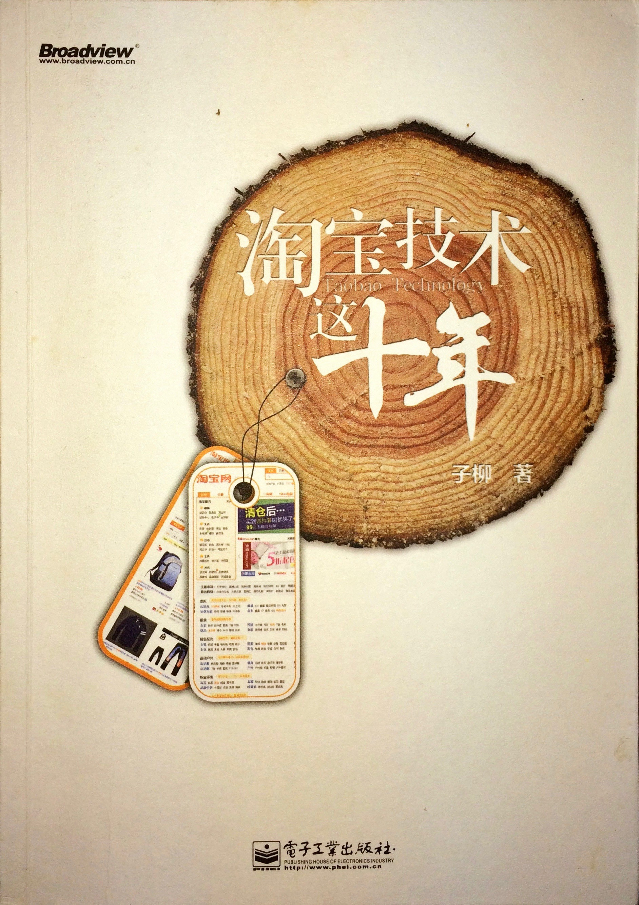

 这是一本关于淘宝的书，多数内容围绕技术主题，但其中一些非技术观点也是非常值得好的，比如“卖家需求的长尾特性”等。正如作者在序言中所说的，这本书前面两章讲故事，关于早期淘宝从无到有从小到大的故事，中间几章主要是讲淘宝的技术演进过程，这也是本书比较具有技术参考价值的部分，最后两章是关于淘宝里面的人，多是一些在淘宝发展过程中扮演重要角色的技术方面的人物。

这本书比较薄，所以并没有很多细节的东西。从技术角度来说，有一些值得参考的故事，从一开始的[LAMP](https://en.wikipedia.org/wiki/LAMP_(software_bundle))架构，到后来的MySQL换到Oracle，再到小型机，开发语言从PHP到Java，CDN，淘宝文件系统[TFS](http://code.taobao.org/p/tfs/src/)，淘宝KV缓存系统[Tair](http://code.taobao.org/p/tair/src/)。

最具有参考价值的是书中关于“分布式电商操作系统”的部分。主要包含“服务化”，“中间件”等内容，将整个系统按照功能进行拆分，使得整个系统之间相互独立，便于开发维护，其中有两个中间件系统：“高性能服务框架HSF”和“异步消息通知系统Notify”，分别以同步和异步的方式把整个系统各个不同部分连接起来，成为一个整体。

对数据库的拆分也是非常重要的内容，这就是关于TDDL(Taobao Distributed Data Layer)，书中并没有非常详细的介绍这部分内容，但可以看出这是非常重要的一个基础工具组件。整个业务代码的开发都依赖它。数据库是现代互联网应用中最为核心的一个组件，其涉及的技术很多偏低层，涉及网络、IO、系统等，所以一般都由专门的DBA来管理，由专门的数据库团队来开发数据库相关的功能。

书中也提到了LVS(Linux Virtual Server)，[OceanBase](http://code.taobao.org/p/OceanBase/src/)数据库等技术和工具。

总体来说，这是一本结合商业与技术的书，内容丰富，文笔自然，如果对相关内容感兴趣，非常值得一读。