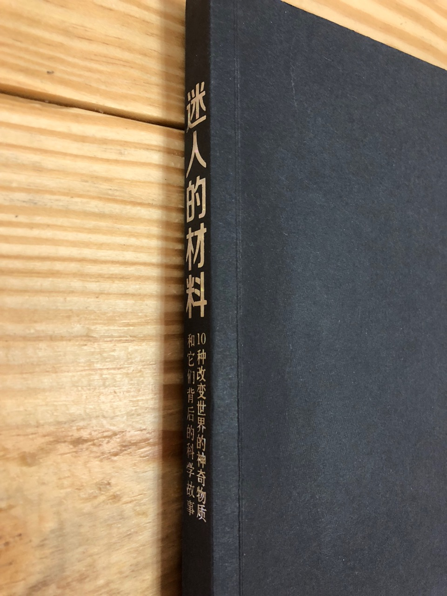

 

这是一本关于材料的书，算是科普类型的。内容难度非常低，作者大多数情况下都是从普通人的角度去讲述，通俗易懂。作者选取了现代生活中最为常见而又是非重要的材料，讲述了每种材料的历史以及其意义。作者的写作风格非常轻松，并非非常严肃的科普风格，所以读起来压力不大，适合大多数人阅读。缺点是整体便感性，不适合作为较为严肃的材料科学入门。全书读完，能够帮助建立对于材料科学的几个核心概念的感性认识。

这本书中所提到的十种材料分别是：钢铁（steel），纸（Paper），混凝土（Concrete）， 巧克力（Chocolate）， 发泡材料（Foam），塑料 （Plastic）， 玻璃（Glass）， 碳材料（Carbon）， 陶瓷器（Porcelain），可植入材料（Implant）。
