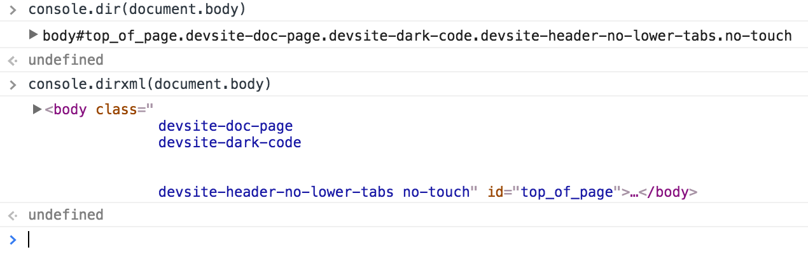

**console** is a special global object in js global namespace, available in both browser and nodejs envirment(though the nodejs version only provides basic features). Nowadays, it is getting even more powerful, more display options, groups, tables, timing support etc. This post is about the features and api of **console** object, using **Google Chrome** browser.

# A List of All console.* functions

To see all the console.* functions, just run `console.dir(console)`:


# String substitution and formatting

Almost all console.* api who accept string or labels support string substitution and formatting, a list of supported format specifier are listed below:

Format Specifier | Output
---|---
%s | Print the value as a string
%i or %d | print the value as an integer
%f | print as floating point value
%o | print as HTML-like object
%O | print as JS-like object
%c | apply css styles

# Logging and Display

* console.log()
* console.info()
* console.debug()
* console.warn()
* console.error()
* console.trace(): print a stack trace
* console.clear(): clears console output

These are all functions for logging output, but they support styles and variable substitutions, which makes them funny to use.

```js
console.log("Node count:", document.body.childNodes.length, "and the current time is:", Date.now());
console.log(1, 2, 3);
console.log(document);
console.log("%c Text with styles!", "color: red; font-size: large");
```


# Visualization

* console.dir()
* console.dirxml()
* console.table()
* console.group()
* console.groupCollapsed()
* console.groupEnd()

`console.dir()` and `console.dirxml()` provide interactive data view, but in different formats, the former shows js object view, the later shows html element tree view. See the different result on `document.body`.




`console.table()` display data with tables:


Note: Chrome's `console.table()` requires data being wrapped within an array, Firefox does't have the restriction, you could just give it an object.

`console.group()` is one of my favourite, usually console output get messy when there are many prints, grouping them together makes console output look way much better, especially when there are multiple chunks of data.


# Timming & Profile

* console.profile()
* console.profileEnd()
* console.time()
* console.timeEnd()
* console.timeStamp()
* ~~console.markTimeline()~~
* ~~console.timeline()~~
* ~~console.timelineEnd()~~

`console.profile()` starts a Javascript CPU profile, `console.profileEnd()` end an in progress profile and add the result to **Profile** panle in DevTools.


`console.time()` and `console.timeEnd()` gives you a timer to keep track of elapsed time, to use multiple timer, give each of them a unique label.


`console.timeStamp()` add an event to **Timeline** panel in DevTools when recording.

# Miscellaneous

* console.assert(expression, object | string)
* console.count()
* console.memory

`console.assert()` provides a basic assert utility, when exprion evaluates to false, it will call `console.error` to print the error message or object.


`console.count(label)` provide a simple yet useful counting mechanism, it takes an optional label, it will associate a counter to each unique label.


`console.memory` shows current tab's js process memory information.


# Fun

You can even print image inside console and have some fun.

See [console.image](https://github.com/adriancooney/console.image),[console.meme](https://github.com/escusado/console.meme), [console.snapshot](https://github.com/adriancooney/console.snapshot)
