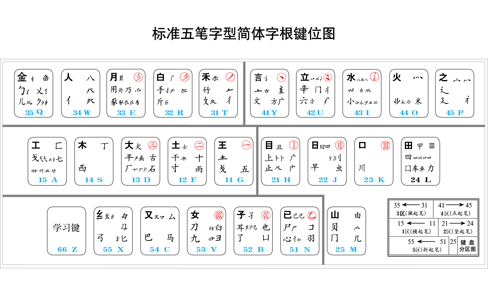
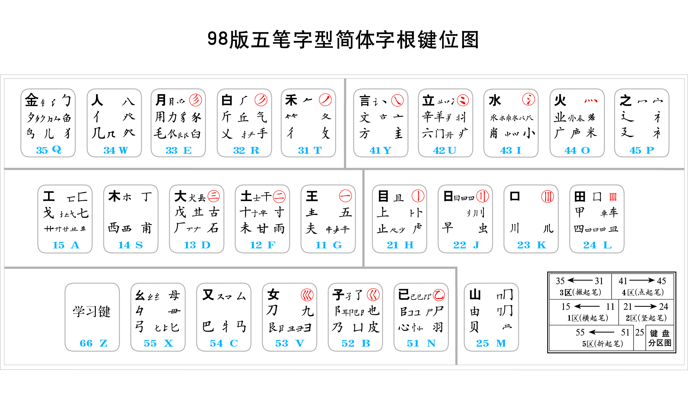
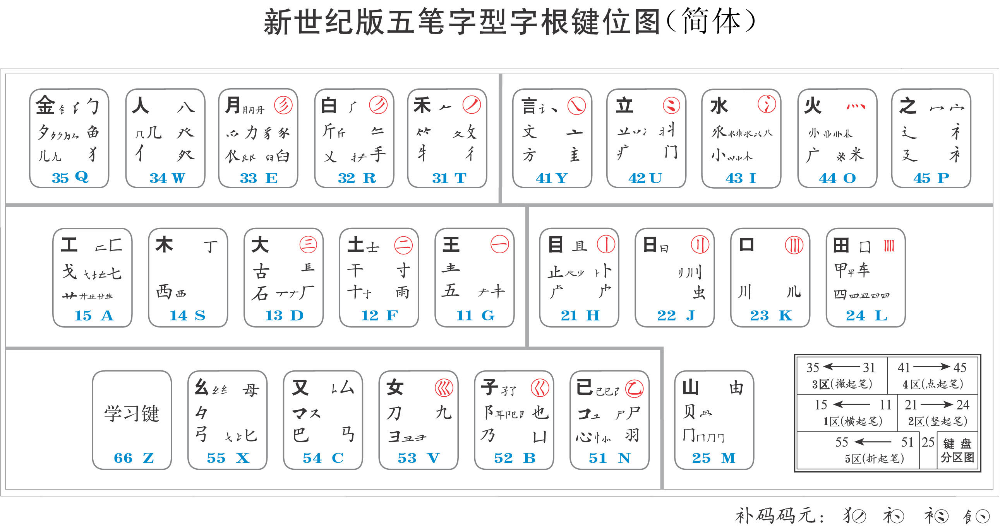

众所周知五笔字形输入法有三个大的版本： **86版**，**98版**，**新世纪版** 三个版本一脉相承，五笔字形输入整体的设计思想并没有变化，但在字根设置以及汉字拆分上有所不同，主要的变化趋势是进一步规范化，合理化，更加符合书写规范，从而更易学易用。 本文从字根，编码两个角度来全面分析三个版本的异同之处，并通过比较大量汉字在三个版本中的编码的不同来具体分析这些变化， 从而更深刻地理解五笔字形输入法的演变过程。另一方面也希望为一些希望学习五笔字形输入法，但不知该选择哪个版本开始的朋友提供一些信息。

现状分析
--------------------------------------------------------------------------------
五笔字形输入法目前基本可以分几大类：

- 官方版： 即由王永民先生的王码公司出品的[五笔字形大一统输入法][dayitong]，这是目前市面上唯一一个同时支持86，98，新世纪三个版本的五笔字形输入法，也是唯一一个能显示汉字字根拆分的输入法。目前售价138元人民币。作为五笔官方的输入法软件，具有一定的权威性。比起第三方五笔输入法，在字库方面不及第三方输入法强大完整，另外，目前只有Windows版本，Mac以及手机都无法使用
- 第三方大公司版： 百度五笔输入法，QQ五笔输入法，搜狗五笔输入法，由大的互联网公司开发，都有云词库支持。
- 第三方独立版： 极点五笔，[鼠须管输入法][rime]，[清歌输入法][qingg]等，由个人或者五笔爱好者社区开发，都没有云词库，功能简洁实用
- 系统内置版：目前Windows10， macOS都内置了五笔字形输入法，但功能比较简单，而且都是基于86版的

目前市面上的五笔字形输入法基本都是基于86版的编码方案，部分已经开始支持98版的编码输入，但截止目前，98版的编码明显不够成熟，新世纪版由于版权的问题（新世纪版的专利是03年授予的，按照目前发明专利20年的有效期，需要到2023年专利到期，在这之前，估计是不会有第三方输入法会官方支持新世纪版五笔输入，用户如果想用，要么购买使用王码公司官方的大一统五笔字形输入软件，要么去网上自己下载第三方制作的新世纪版码表，然后导入到支持第三方码表的输入法中（严格上这有侵权嫌疑）。

由于86版普及早，用户多，软件和支持也最成熟，所以是目前五笔的主流。98版和新世纪版虽然是在86版的基础上改进的，但由于各种原因，至今使用率不高，在五笔用户中算比较小众的。

如何分辨三个版本
--------------------------------------------------------------------------------
只要输入一个比较有代表性的汉字的编码，即可分辨：
例如输入**xxx**码，86版会出来**字**， 98版会出来**字**， 新世纪版最出来**字**。

字根的变化
--------------------------------------------------------------------------------

通过观察官方的字根表，我们不难发现一下特点：

编码的量化分析
--------------------------------------------------------------------------------
- 86版单字重码率：
- 98版单字重码率：
- 新世纪版单字重码率：

一些汉字编码的具体分析
--------------------------------------------------------------------------------

字|86版编码|98版编码|新世纪版编码|编码比较分析|结果
:--:|:----:|:----:|:--------:|:---:|:--:
亏|FNV| FNB|FNV|新世纪版比较合理|新世纪
亏|FNV| FNB|FNV|新世纪版比较合理|新世纪
亏|FNV| FNB|FNV|新世纪版比较合理|新世纪
亏|FNV| FNB|FNV|新世纪版比较合理|新世纪
亏|FNV| FNB|FNV|新世纪版比较合理|新世纪

总结
--------------------------------------------------------------------------------

[wangma]: http://www.wangma.net.cn/
[dayitong]: http://www.wangma.net.cn/prodetail.aspx?sm=2&p=1
[rime]: http://rime.im/ "中州韻輸入法引擎"
[qingg]: https://qingg.im/ "清歌输入法"
