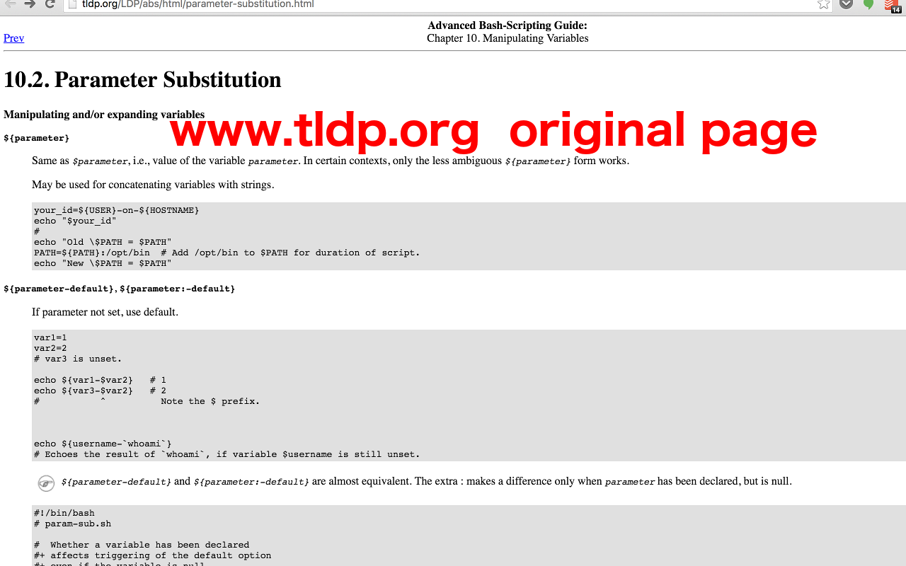
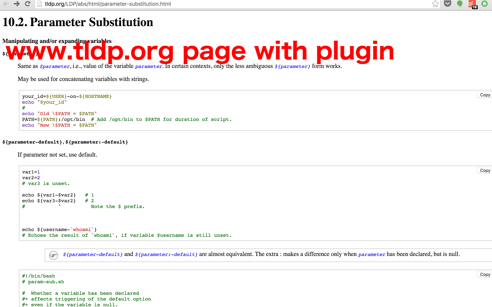

This is a simple **chrome browser plugin**, it has only several simple features:

- **Highlight** code blocks on [www.tldp.org][tldp], to make code more readable
- Add a **Click to Copy** button on all code blocks, copy code block with just one click
- Tweak some element styles on the page, to make keywords, italics emphasises etc outstanding

Download and Try it in [Chrome Webstore](https://chrome.google.com/webstore/detail/tldp-code-highlighter/feecfpbibhpnlbnpoclkdhgbclgdpjba?hl=en-US).

## The tldp.org page without plugin:

## The tldp.org page with plugin:

[tldp]: http://www.tldp.org "The Linux Documentation Project"
